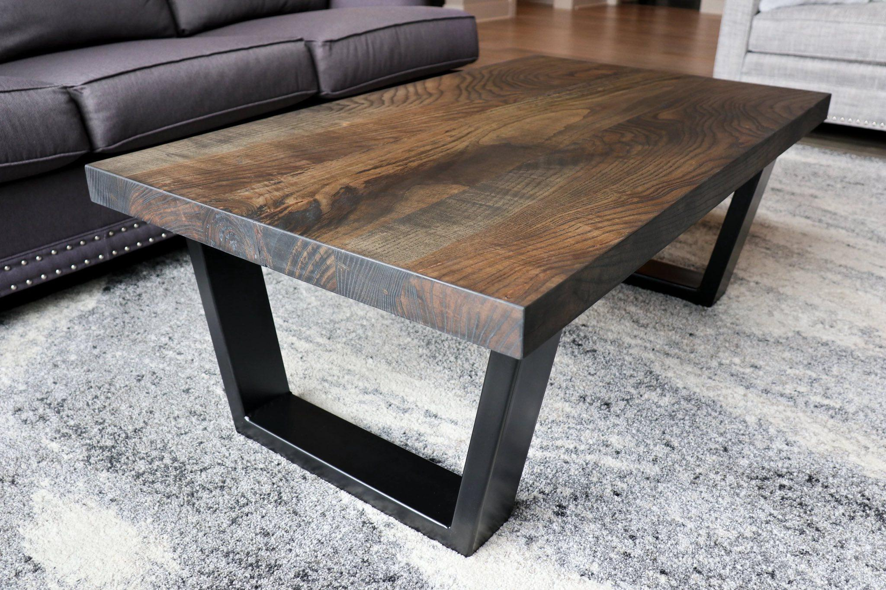
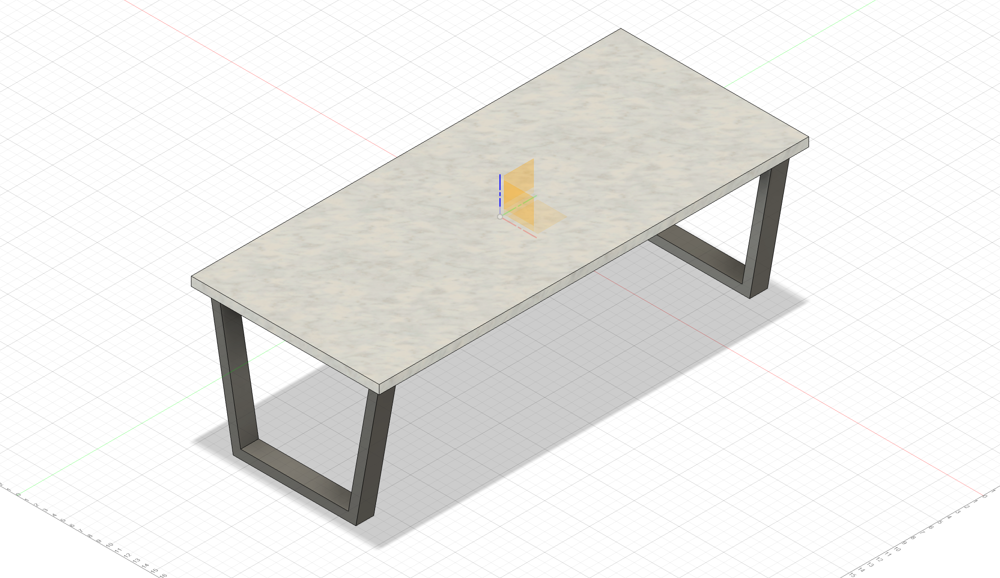

Adrienne found this design. It looks buildable. The angled legs give more visual interest than rectilinear ones.

The inspiration image looks like it's a size I can't get in rectangular tube at Asero. Looks wider than 1 x 2, which is what they have.

I wrestled my way through modeling this in Fusion 360. Getting a distinctly non-right angle was a little tricky. I think the inspiration table may be pretty short for its width, because any angle more than 100 degrees at the base starts getting narrower than looks safe.

### Navigation
* [README](README.md)
* [2024-02-10 Inspiration + Modeling](2024-02-10%20Inspiration%20+%20Modeling.md)
* [2024-02-17 Asero](2024-02-17%20Asero.md)
* [2024-02-19 Cutting](2024-02-19%20Cutting.md)
* [2024-02-24 Bolts](2024-02-24%20Bolts.md)
* [2024-03-02 Asmbly](2024-03-02%20Asmbly.md)
* [2024-03-03 Grinding, Outside Corners, Grinding](2024-03-03%20Grinding,%20Outside%20Corners,%20Grinding.md)
* [2024-03-17 Second Side](2024-03-17%20Second%20Side.md)

