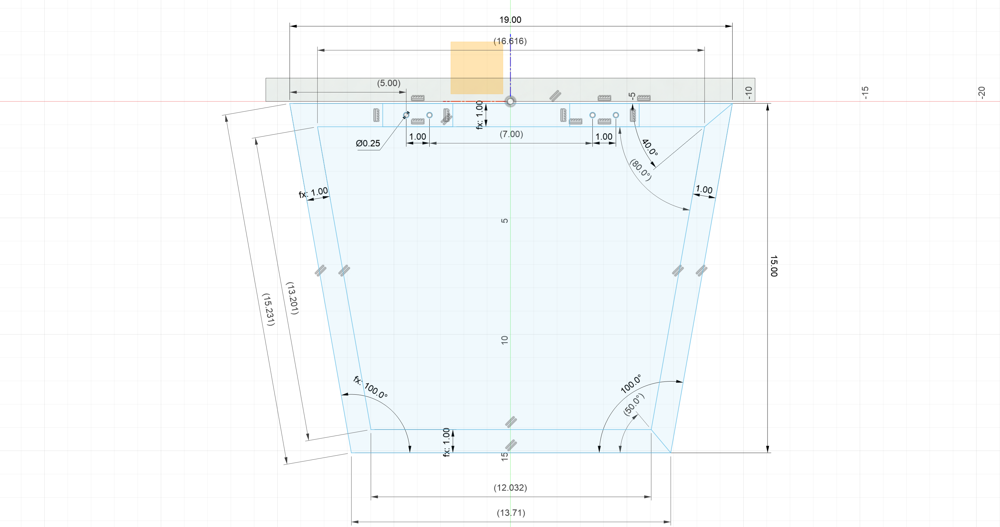
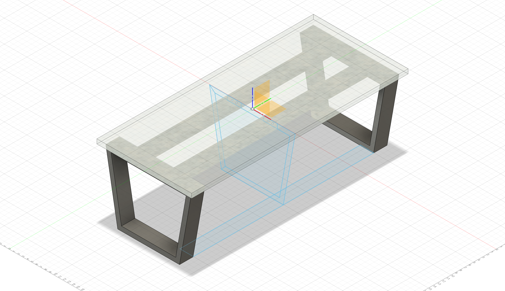

Surprise! Asero has 1" x 3" rectangular tube. They just don't have it in their online stock list for some reason. I bought a 24' stick, cut into 48" sections. That gives me a full 48" piece for mistakes.

Sadly, the Free "Personal" version of Fusion 360 doesn't let me save a construction drawing. I can export images, though. So I've printed off one with the sketch that shows all of the dimensions.

Here's what the table should look like with 1" x 3" tube:

### Navigation
* [README](README.md)
* [2024-02-10 Inspiration + Modeling](2024-02-10%20Inspiration%20+%20Modeling.md)
* [2024-02-17 Asero](2024-02-17%20Asero.md)
* [2024-02-19 Cutting](2024-02-19%20Cutting.md)
* [2024-02-24 Bolts](2024-02-24%20Bolts.md)
* [2024-03-02 Asmbly](2024-03-02%20Asmbly.md)
* [2024-03-03 Grinding, Outside Corners, Grinding](2024-03-03%20Grinding,%20Outside%20Corners,%20Grinding.md)
* [2024-03-17 Second Side](2024-03-17%20Second%20Side.md)
* [2024-11-22 Restarting](2024-11-22%20Restarting.md)
* [2024-11-23 Holes](2024-11-23%20Holes.md)
* [2024-11-29 Holes again](2024-11-29%20Holes%20again.md)

