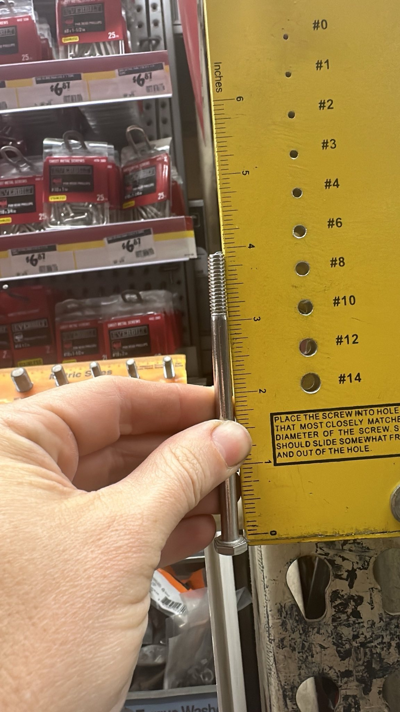

I've decided to bolt the horizontal pieces in place, rather than welding them. This should make the welding much easier, since I only need to get things precise for flat pieces (the sides), rather than the whole 3D structure. The plan is to cut caps for the long tubes, drill holes through the top of the sides and the caps, and weld nuts inside the caps.

Challenge: I don't want to weld zinc or galvanized, so this means stainless nuts and bolts. Not sure if I should bother TIG welding stainless to mild steel or just MIG them like the rest. Probably good practice to use TIG, even though the result won't be stainless when I'm done.

It turns out that the stainless bolts they have at Home Despot are only threaded about 3/4", even if the bolt is 4" long.

### Navigation
* [README](README.md)
* [2024-02-10 Inspiration + Modeling](2024-02-10%20Inspiration%20+%20Modeling.md)
* [2024-02-17 Asero](2024-02-17%20Asero.md)
* [2024-02-19 Cutting](2024-02-19%20Cutting.md)
* [2024-02-24 Bolts](2024-02-24%20Bolts.md)
* [2024-03-02 Asmbly](2024-03-02%20Asmbly.md)
* [2024-03-03 Grinding, Outside Corners, Grinding](2024-03-03%20Grinding,%20Outside%20Corners,%20Grinding.md)
* [2024-03-17 Second Side](2024-03-17%20Second%20Side.md)

