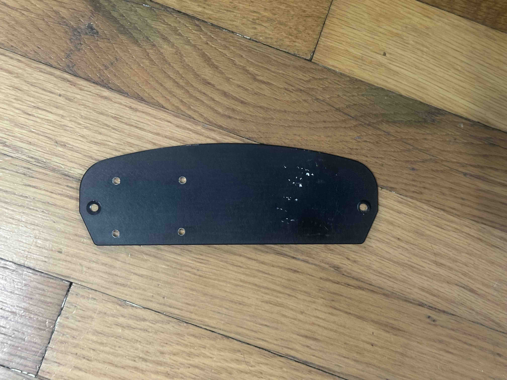
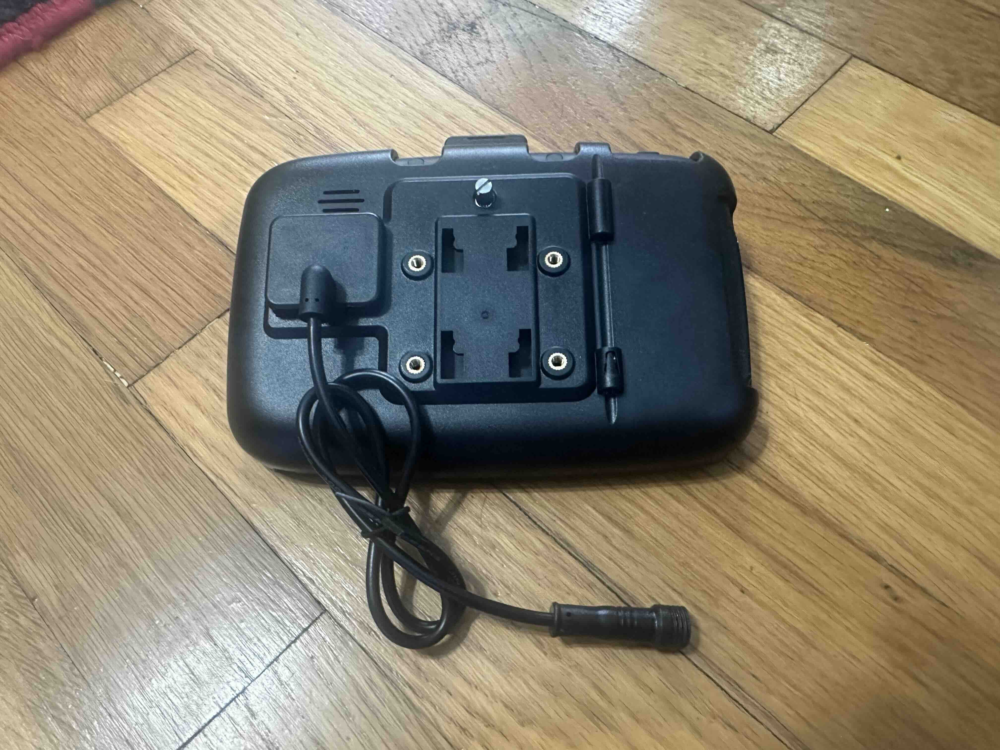
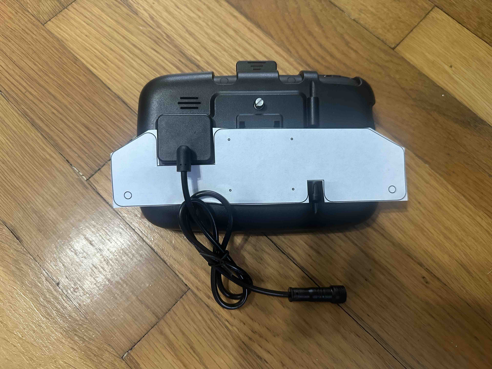

This is the old plate. The rectangle of holes are for mounting the Zumo. The two outer, countersunk holes are for attaching the plate to the windscreen mount.

This is the back of the new CarPlay device. It had a ball mount screwed into the rectangle. But we want the mounting to be fixed, so we took that off.

Here's the new mounting plate modeled. Note that the device sits much higher than the Zumo used to. Adrienne had trouble seeing the indicators at the top of the dashboard, so we're mounting this higher. Also, there are cutouts for some of the geometry of the device.

