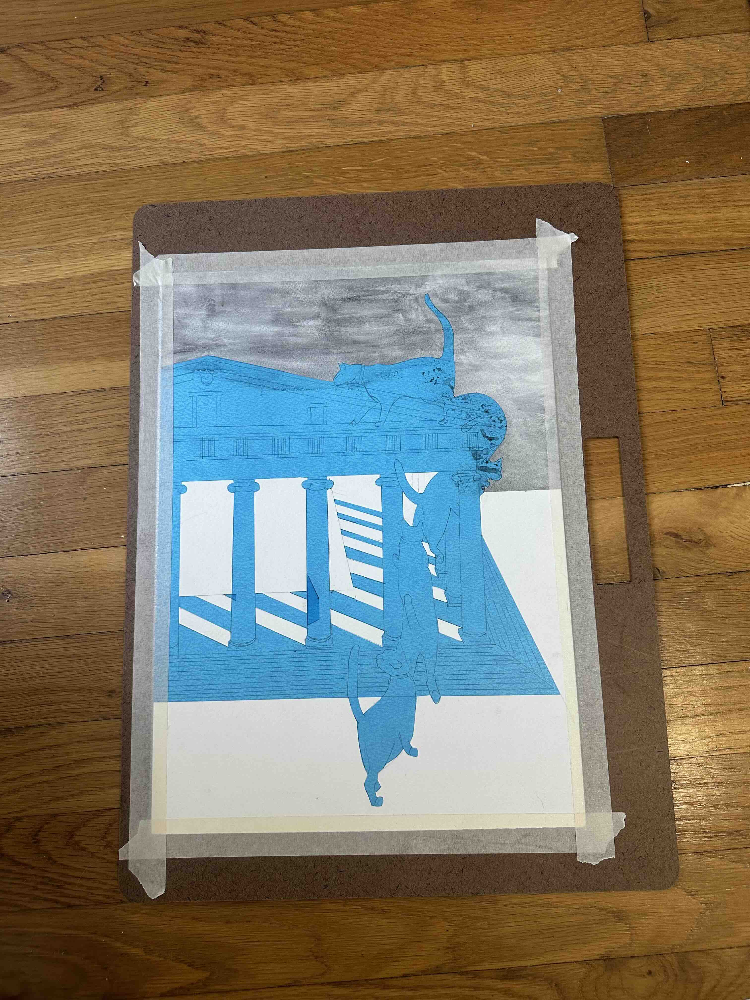

I'm taking an art class (Design 1 at [ACC](https://austincc.edu)) where we're doing a bunch of work on 11x15" watercolor paper. I wanted a board to transport works-in-progress on that would protect them against bending in my giant messenger bag. A trip to the local art store determined that they only had enormous ones that wouldn't fit in my bag. But when I asked, the person at the counter said they didn't have different sizes, but she usually just cuts down some MDF when she wants a different size.

💡

Hey, I can do that. I bought a sheet of 1/8x24x48" MDF and whipped up a quick model in Fusion.

I started adding holes for different sizes of paper and designed little stops so the paper could be placed precisely. I looked at material for the stops, and realized that the best I have on hand for that is aluminum (I could 3D print something, but...).

And then I caught myself. Why do I need the paper aligned? It'll be held to the board with masking tape. if it's a little off, that's no problem.

So I went to [Asmbly](https://www.asmbly.org) and dashed off a cut of the outline on the CNC router.

Lessons learned:
* Keep it simple.
* A router job can be super quick.
* The vacuum hold down system on the big router is pretty sweet if you're taking light cuts.
* Next time, cut the whole radius for the handle, not just the small corners