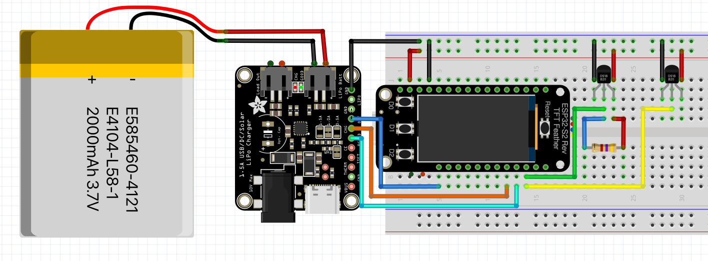

### Hardware

2023-07-06

Got a bunch of [parts](notebook/esp-pool-temp/Hardware.md) from Adafruit.

Tried to find a good tool to lay out the connections on a protoboard. Tried [KiCad](https://www.kicad.org/) and [Fritzing](https://fritzing.org/) and neither was remotely what I was looking for. I should have just used paper.

This Fritzing breadboard layout wasn't _entirely_ unhelpful, but it bears little resemblance to what got built.

I ended up #soldering it up using an expensive Featherwing #protoboard instead of a cheap generic one because it was easier to break out the pins of the Feather and it provided handy power and ground strips.

> Lesson Learned:
> Find your diagonal flush cutters. Using wire cutters to clip leads is hard and gives bad results.

### Software

2023-07-08

I started out trying to use the WipperSnapper No-Code platform, but found it frustratingly opaque to debug. Loading Circuit Python turned out to be very difficult... because I was trying to load the binary for an ESP32-S3 not an S2, and it rightly rejected it over and over until I got fed up, wrote a post on the Adafruit forums asking for help, proofread the post, and noticed the S3 🤦🏻.

I built up a [Circuit Python script](https://github.com/WanderingStar/pool_temp/blob/main/code.py) out of a bunch of samples from Adafruit, one element at a time. The other scripts in that repo are the parts.

> Lesson Learned:
> The TFT was quite handy for debugging. I figured I should have it off most of the time, to save power, so the NeoPixel LED was also handy. I had it change color so I could know the script was still running even while the screen was off.

Overall, this worked pretty well.

### Enclosure

The [weatherproof enclosure](https://www.adafruit.com/product/903) that Adafruit sells fit the project pretty well. I got some plastic cards intended for ID badges, thinking I'd make a support to hold the protoboard and pieces in place, but I ended up leaving the parts loose in the enclosure.

I drilled holes in the enclosure to pass the temperature probes and barrel jack through. I think I would do this differently in hindsight. I'd soldered everything up, which meant that I had to pass the probes through from the inside out. I drilled the holes big enough for the probes, but the fit was tight and I disturbed the heatshrink on the probes.

> Lesson Learned:
> Don't solder sensors (or other things that belong on the outside of the enclosure) directly to the board. I got some screw terminal blocks for future projects.

If I'd temporarily attached the sensors instead of soldering them, I could have made the hole only big enough for the cable, not for the whole probe, **and** I would have had an easier time reworking the board (foreshadowing...).

I think I would also not use the barrel jack for the solar connection in future projects. Bare wires would have meant I could have drilled a smaller hole and had more flexibility about the placement of the charger board in the box.

I used Sugru to mold nubbins around the drilled holes. I suspect the project is not submersible, but I'm pretty confident it'll be fine in rain.