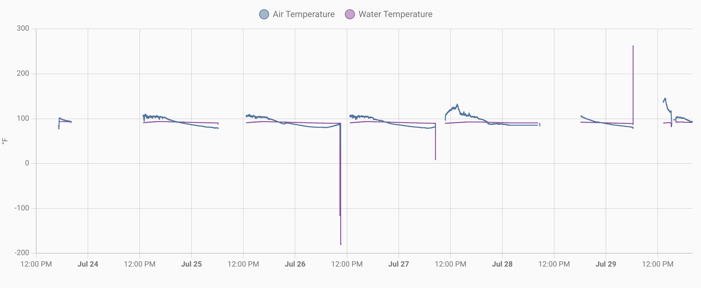

#electronics #feather #esp8266 #esphome

Here's a few day's worth of data...

Not great. I suspect that V2 is chewing through the whole battery. I've been going out there and resetting it daily, and have tried moving the solar panel into sunnier spots, but it hasn't really helped.

Hypotheses:
1. The ESP8266 is just more power hungry than the ESP32-S2
2. The esphome code is keeping it more active than the circuit python code did
3. Something in the circuit python code is triggering a sleep mode (maybe the `time.sleep`?)

## Setting up voltage monitoring

The ESP8266 needs RST connected to GPIO 16 to support deep sleep mode, and, unlike the S2 Feather, the Huzzah doesn't have a battery monitor. Happily, Adafruit [has a suggestion for that](https://learn.adafruit.com/using-ifttt-with-adafruit-io/wiring#battery-tracking). It means giving up the only Analog to Digital converter on the Huzzah, but we weren't using it for anything here anyway. Setting up the esphome config for this was pretty straightforward. I measured the actual voltage and the fraction returned by the voltage divider, and set up a filter to scale the values. Hopefully this will let me confirm if the power is indeed the problem.

The protoboard is getting increasingly crowded, but I cleaned up some of the badly-clipped leads with a new pair of flush cutters.

If the power is the problem, maybe we can...
- Use the deep sleep mode
- Use MQTT to push the values rather than the home assistant API pulling them ([see](https://ncrmnt.org/2021/12/06/optimizing-esp8266-esphome-for-battery-power-and-making-an-ice-bath-thermometer-as-well/))

### Navigation
* [README](README.md)
* [2023-07-23 ESP8266 esphome](2023-07-23%20ESP8266%20esphome.md)
* [2023-07-29 Power Problems](2023-07-29%20Power%20Problems.md)
* [2023-07-30 Deep Sleep](2023-07-30%20Deep%20Sleep.md)
* [2023-07-31 MQTT](2023-07-31%20MQTT.md)
* [2023-08-01 Tweaks](2023-08-01%20Tweaks.md)
* [2023-09-29 Power strangeness](2023-09-29%20Power%20strangeness.md)

