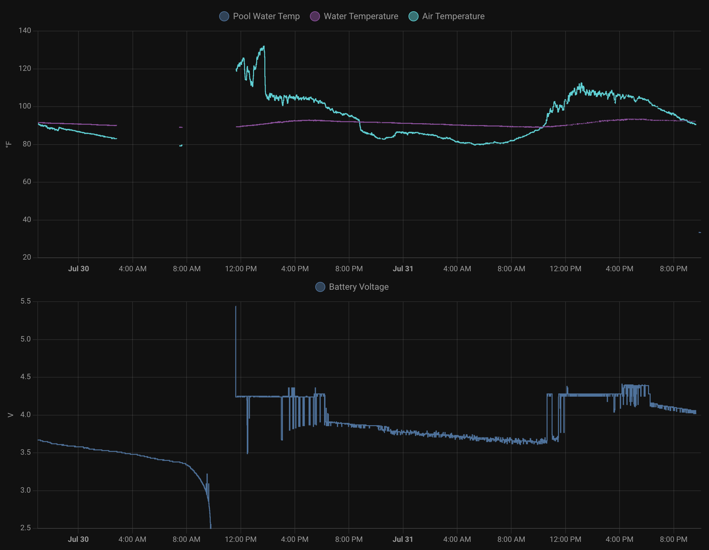

Deep sleeping worked. The power usage was much more reasonable and we easily made it through the day without an interruption.

---

Using the Home Assistant API seems to make the system aggressively consider things "offline" during the deep sleep.

I decided to use MQTT instead of the HA API. I didn't figure out how discovery worked until after configuring everything with raw MQTT topics in HA configuration.yaml:
```
mqtt:
    sensor:
      - name: "Pool Water Temp"
        state_topic: "pool-8266/sensor/water_temperature/state"
        unit_of_measurement: "°C"
        device_class: "temperature" 
        icon: "mdi:pool-thermometer"
```

But maybe that's for the best, because the graphs for the discovered sensors are choppy, especially after I changed the duty cycle of the system to 15s per 5 minutes.

I also figured out how to log values, though I had to dig around in the cpp to find the right names for things...

```
- logger.log: 
  format: "Considering nap: MQTT %d, Prevent %s, %.2fV"
  args: [ 'mqtt_mqttclientcomponent->is_connected()', 'id(prevent_deep_sleep).state.c_str()', 'id(battery_voltage).state' ]
```

```
open .esphome/build/pool-8266/src/main.cpp
```

```
lambdaaction_4 = new LambdaAction<>([=]() -> void {
      ESP_LOGD("main", "Considering nap: MQTT %d, Prevent %s, %.2fV", mqtt_mqttclientcomponent->is_connected(), prevent_deep_sleep->state.c_str(), battery_voltage->state);
  });
```
